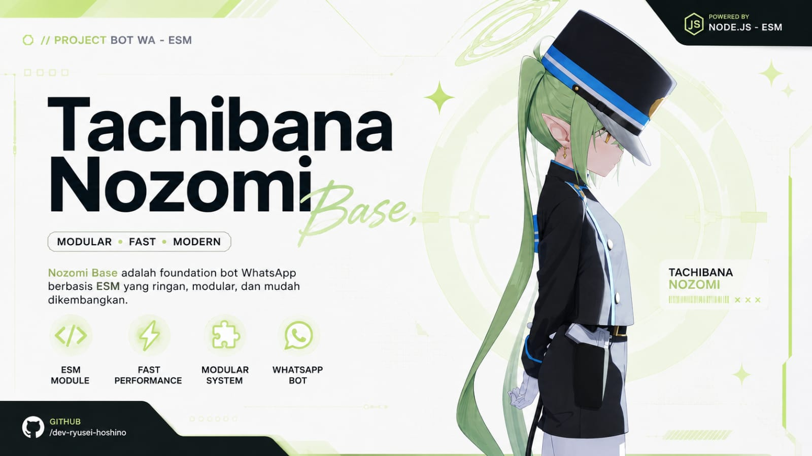

 
<h1 align="center">Nozomi-Base (ESM)</h1>
<p align="center"><b>Nozomi-Base</b> is a ready-to-use and extensible WhatsApp bot base, allowing developers to focus on building features instead of dealing with connection handling, authentication, and other boilerplate setup.</p>

<br>

## > About the Project Name

The name **Nozomi-Base** is inspired by **Tachibana Nozomi** from the game _Blue Archive_. This project uses the character's name solely as a source of inspiration for its identity and branding.

**Nozomi-Base** is an independent, fan-made open-source project and is **not affiliated with, endorsed by, or sponsored by** Nexon Games, Yostar, or any other official parties associated with _Blue Archive_.

All rights to **Blue Archive**, including its characters, names, artwork, music, and other intellectual property, remain the property of their respective copyright owners. This repository does not claim ownership of any _Blue Archive_ intellectual property.

If you are the rightful copyright holder and believe that any content in this repository infringes upon your rights, please contact the maintainer so the issue can be reviewed and resolved appropriately.

<br>

<h2 align="center">Preview</h2>
<div align="center" style="display: flex; justify-content: center; align-items: center; gap: 10px">
  
</div>

<br>

## > Key Features

```

* Automatic Plugin System (Hot Reload): Add, edit, or remove `.plugin.js` files without restarting the bot. Changes are detected automatically within approximately 100ms.

* Powerful Interactive Messages: Powered by MessageBuilderV4.6, making it easy to send buttons, carousels, tables, syntax-highlighted code blocks, and many other interactive components.

* Lightweight & Database-Free: No `.env`, MySQL, or MongoDB required. Everything runs using memory or the local filesystem, making it ideal for low-cost VPS hosting or local development.

* Flexible & Reliable Login: Supports authentication via Pairing Code (phone number) or QR Code, with an intelligent auto-reconnect system.

* Smart Developer Experience: Includes Fuzzy Matching to automatically detect and correct mistyped commands.

* Cross-Platform: Works on Termux, Windows, Linux, Pterodactyl panels, and more.

```

## > Quick Start
```bash
git clone https://github.com/dev-ryusei-hoshino/Nozomi-Base
cd Nozomi-Base
npm install
npm install sharp
npm start
```
<br>

For android/Termux:
```bash
git clone https://github.com/dev-ryusei-hoshino/Nozomi-Base
cd Nozomi-Base
npm install
npm install sharp @img/sharp-wasm32
npm start
```

> **Connection:** Enter your WhatsApp phone number in the terminal (format: `628...`), then enter the generated pairing code from **Linked Devices** in your WhatsApp application.

<br>

## > Plugin Example

```javascript
export default {
  name: <plugin_name>,
  command: [<command1>, <command2>],
  category: <category>,
  description: <description>,
  owner_only: boolean,  /* true | false */
  private_only: boolean, /* true | false */
  group_only: boolean, /* true | false */

  async run(conn, m, {
    jid,
    senderJid,
    senderLid,
    senderName,
    formattedLid,
    senderNumber,
    args,
    usedPrefix,
    isOwner,
    isAdmin,
    isBotAdmin,
    isGroup,
    isPrivate,
    isBroadcast,
    isChannel,
  }) {
    try {
      // Your code here
    } catch (e) {
      console.log(e);
      await m.react("❌");
    }
  },
};
```

> **Note:** Plugin filenames **must** end with `.plugin.js` (for example: `ping.plugin.js`) so they can be automatically detected by the plugin loader.

<br>

## > Configuration Example

```javascript
import packageFile from "./package.json" with { type: "json" };

export default {
  // false = Pairing Code, true = QR Code
  pairingWithQr: false,

  // Disable only if absolutely necessary
  ignore_self: true,

  markOnlineOnConnect: true,

  // Automatically mark incoming messages as read
  auto_read: true,

  bot: {
    name: "Nozomi Base",
    slog: "Pyahyaya~!",
    ver: packageFile.version,

    thumb:
      "https://i.ibb.co.com/0yJCNd0C/b1140d19-b147-4db9-8189-a0df99852a50.jpg",

    // Not really necessarry
    vid_thumb:
      "https://cdn.ornzora.eu.cc/7e92c9af-9e11-42f1-803c-8c23ecdb0ffe-upload-1786022115577.mp4",

    prefix: ["!", "."],

    owner: {
      number: "6285198221676",
      name: "Ryusei Hoshino",
    },
  },

  mess: {
    owner: "🚫 Access denied. This feature is restricted to the bot owner.",
    admin: "🚫 Access denied. Only group administrators can use this feature.",
    bot_not_admin: "⚠️ The bot must be an administrator to use this feature.",
    group: "⚠️ This feature can only be used in group chats.",
    private: "⚠️ This feature is only available in private chats.",
    premium:
      "🚫 Access denied. This feature is available to premium users only.",
    wait: "⏳ Processing your request...",
    plugin_not_available:
      "❌ Error: The requested plugin is currently unavailable.",
  },
};
```

<br>

<div style="display:flex;flex-direction:column;gap:10px;margin-top:10px;">

<a href="https://whatsapp.com/channel/0029VbDnVYyK0IBjO8RGfq3N"
style="display:flex;align-items:center;justify-content:center;padding:12px 16px;border:1px solid #061f00;border-radius:12px;background-color:#54af0a;text-decoration:none;"> <strong>WhatsApp Channel</strong> </a>

<a href="https://wa.me/6283892508772"
style="display:flex;align-items:center;justify-content:center;padding:12px 16px;border:1px solid #ffbb00;border-radius:12px;text-decoration:none;"> <strong>Contact the Owner (WhatsApp)</strong> </a>

</div>
